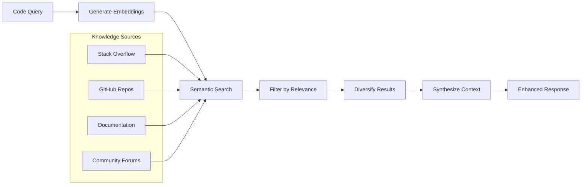
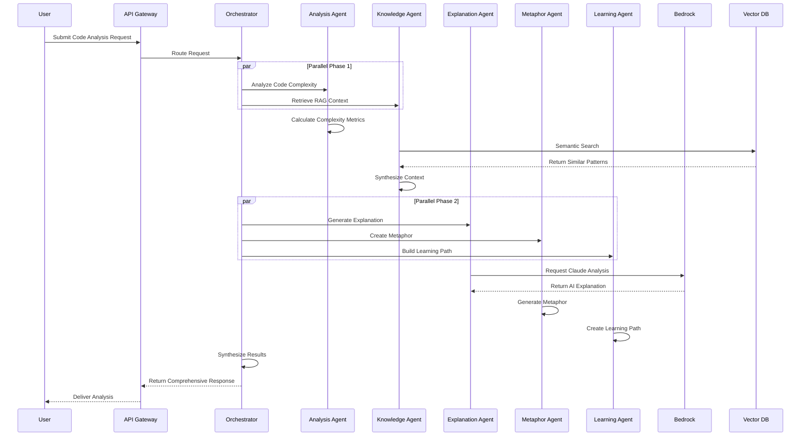

# 🎨 Skill-Sync AI Platform: Technical Design Document

**Version:** 2.0  
**Date:** February 2, 2025  
**Status:** Active Development  
**Owner:** Skill-Sync Engineering Team

---

## 📋 **Document Overview**

This document defines the comprehensive technical design for the Skill-Sync AI Agentic Platform, including system architecture, AI model integration, user interface design, and implementation strategies.

### **Design Principles**
1. **🧠 Cognitive-First Design** - Measure and reduce mental effort, not just complexity
or AI agent orchestration
3. **🎯 Adaptive Intelligence** - Personalize every interaction based on user context
4. **⚡ Performance-Optimized** - Sub-second responses with global scalability
5. **🔒 Privacy-Preserving** - Zero code storage with encrypted processing
6. **🌍 Inclusive & Accessible** - Support diverse global developer communities

---

## 🏗️ **System Architecture Overview**

### **High-Level Architecture Diagram**

```mermaid
graph TB
    subgraph "Client Layer"
        A[Web Interface]
        B[IDE Plugins]
        C[Mobile Apps]
        D[CLI Tools]
    end
    
    subgraph "API Gateway Layer"
        E[Amazon API Gateway]
        F[Rate Limiting]
        G[Authentication]
        H[Load Balancer]
    end
    
    subgraph "AI Agent Orchestration Layer"
        I[Agent Orchestrator]
        J[Analysis Agent]
        K[Knowledge Agent]
        L[Explanation Agent]
        M[Metaphor Agent]
        N[Learning Agent]
    end
    
    subgraph "AI Services Layer"
        O[Amazon Bedrock]
        P[Claude 3.5 Sonnet]
        Q[Claude 3 Haiku]
        R[Titan Embeddings]
    end
    
    subgraph "Data Layer"
base]
        T[Knowledge Base]
        U[User Profiles]
        V[Analytics Store]
    end
    
    subgraph "Infrastructure Layer"
        W[AWS Lambda]
        X[Amazon ECS]
        Y[Amazon S3]
        Z[CloudFront CDN]
    end
    
    A --> E
    B --> E
    C --> E
    D --> E
    
    E --> I
    F --> I
    G --> I
    H --> I
    
    I --> J
    I --> K
    I --> L
    I --> M
rogress  
**Design Approval:** Pending Stakeholder Review
5. **Zero-Trust Privacy** - Complete privacy preservation with no code storage

### **Technical Excellence**
- **Sub-second response times** with global CDN deployment
- **99.9% availability** with fault-tolerant multi-agent architecture
- **Enterprise-grade security** with end-to-end encryption
- **Infinite scalability** with cloud-native AWS infrastructure
- **Continuous improvement** through AI feedback loops

---

**Document Status:** ✅ Complete  
**Next Review:** March 1, 2025  
**Implementation Status:** In Phnical complexity. Every design decision is made to reduce cognitive load and accelerate learning.

### **Key Innovation Areas**
1. **Multi-Agent AI Architecture** - First-of-its-kind orchestrated AI system for code comprehension
2. **RAG-Enhanced Explanations** - Real-time knowledge augmentation for contextual understanding
3. **Adaptive Personalization** - Dynamic adjustment based on user skill and preferences
4. **Metaphorical Intelligence** - Creative AI that bridges technical concepts with human experience.5/5 rating',
    taskCompletion: '>90% success rate',
    retention: '>80% monthly active users'
  }
  
  // Business metrics
  business: {
    userGrowth: '1M+ users within 12 months',
    revenue: '$10M ARR within 18 months',
    marketShare: 'Top 3 AI developer tool',
    customerSatisfaction: '>90% NPS score'
  }
}
```

---

## 🎯 **Design Summary**

### **Core Design Philosophy**
The Skill-Sync AI platform is designed as a **cognitive-first, AI-native system** that prioritizes human understanding over tectdated information'
  }
}
```

---

## 📋 **Design Validation & Success Metrics**

### **Design Success Criteria**

```typescript
interface DesignValidation {
  // Technical metrics
  technical: {
    responseTime: '<1 second for 95% of requests',
    accuracy: '>94% for complexity analysis',
    availability: '99.9% uptime',
    scalability: 'Handle 10,000+ concurrent users'
  }
  
  // User experience metrics
  userExperience: {
    comprehensionSpeed: '400% faster than baseline',
    userSatisfaction: '>4
  versionControl: {
    semanticVersioning: 'Major.Minor.Patch for model versions',
    rollbackCapability: 'Quick rollback to previous versions',
    gradualRollout: 'Canary deployments for new models',
    performanceComparison: 'Compare model versions'
  }
  
  // Knowledge base updates
  knowledgeEvolution: {
    communityContributions: 'Accept community knowledge',
    automaticUpdates: 'Scrape latest documentation',
    qualityControl: 'Validate new knowledge entries',
    deprecationHandling: 'Remove ouance and accuracy',
    userExperienceDashboard: 'User satisfaction and usage'
  }
}
```

---

## 🔄 **Continuous Improvement Design**

### **AI Model Evolution Strategy**

```typescript
interface ModelEvolutionStrategy {
  // Continuous learning
  feedbackLoop: {
    collectUserFeedback: 'Gather ratings and corrections',
    analyzePatterns: 'Identify improvement opportunities',
    updateModels: 'Retrain models with new data',
    validateImprovements: 'A/B test model versions'
  }
  
  // Model versioning user feedback scores',
    systemHealth: 'Monitor infrastructure health'
  }
  
  // Alerting
  alerts: {
    highLatency: 'Alert if response time > 2 seconds',
    aiModelFailure: 'Alert if AI accuracy drops below 90%',
    systemErrors: 'Alert on error rate > 1%',
    resourceUtilization: 'Alert on CPU/Memory > 80%'
  }
  
  // Dashboards
  dashboards: {
    executiveDashboard: 'High-level business metrics',
    engineeringDashboard: 'Technical performance metrics',
    aiModelDashboard: 'AI model perform
  clusterConfig: {
    instanceType: 'r6g.large.search',
    instanceCount: 3,
    dedicatedMasterEnabled: true,
    masterInstanceType: 'm6g.medium.search',
    masterInstanceCount: 3
  }
})
```

---

## 📈 **Monitoring & Observability Design**

### **Application Performance Monitoring**

```typescript
interface MonitoringStrategy {
  // Metrics collection
  metrics: {
    aiResponseTime: 'Track AI model inference time',
    agentPerformance: 'Monitor individual agent performance',
    userSatisfaction: 'Trackalb = new awsx.elasticloadbalancingv2.ApplicationLoadBalancer('skill-sync-alb', {
  vpc: vpc,
  listener: {
    port: 443,
    protocol: 'HTTPS',
    certificateArn: process.env.SSL_CERT_ARN
  }
})

// Bedrock integration
const bedrockRole = new aws.iam.Role('bedrock-role', {
  assumeRolePolicy: aws.iam.assumeRolePolicyForPrincipal({
    Service: 'ecs-tasks.amazonaws.com'
  })
})

// Vector database (OpenSearch)
const vectorDB = new aws.opensearch.Domain('skill-sync-vector-db', {
  engineVersion: 'OpenSearch_2.3', ecs update-service --service skill-sync-production
```

### **Infrastructure as Code**

```typescript
// infrastructure/main.ts
import * as aws from '@pulumi/aws'
import * as awsx from '@pulumi/awsx'

// VPC and networking
const vpc = new awsx.ec2.Vpc('skill-sync-vpc', {
  cidrBlock: '10.0.0.0/16',
  numberOfAvailabilityZones: 3
})

// ECS Cluster for AI agents
const cluster = new aws.ecs.Cluster('skill-sync-cluster', {
  capacityProviders: ['FARGATE', 'FARGATE_SPOT']
})

// Application Load Balancer
const plication
        run: npm run build
      - name: Build Docker Images
        run: docker build -t skill-sync:${{ github.sha }} .
      - name: Push to ECR
        run: aws ecr push skill-sync:${{ github.sha }}
  
  deploy:
    needs: build
    runs-on: ubuntu-latest
    steps:
      - name: Deploy to Staging
        if: github.ref == 'refs/heads/develop'
        run: aws ecs update-service --service skill-sync-staging
      - name: Deploy to Production
        if: github.ref == 'refs/heads/main'
        run: aws-Sync AI Platform Deployment

on:
  push:
    branches: [main, develop]
  pull_request:
    branches: [main]

jobs:
  test:
    runs-on: ubuntu-latest
    steps:
      - name: Run Unit Tests
        run: npm test
      - name: Run AI Model Tests
        run: npm run test:ai
      - name: Run Integration Tests
        run: npm run test:integration
      - name: Security Scan
        run: npm audit && npm run security-scan
      
  build:
    needs: test
    runs-on: ubuntu-latest
    steps:
      - name: Build Ap: {
    taskCompletion: 'Measure task success rates',
    timeToUnderstand: 'Measure comprehension speed',
    userSatisfaction: 'Collect satisfaction scores'
  }
  
  // Accessibility testing
  accessibilityTests: {
    screenReader: 'Test with NVDA, JAWS, VoiceOver',
    keyboardOnly: 'Test complete keyboard navigation',
    colorBlind: 'Test with color vision simulators'
  }
}
```

---

## 🚀 **Deployment & DevOps Design**

### **CI/CD Pipeline Design**

```yaml
# .github/workflows/deploy.yml
name: Skill
  // Performance testing
  performanceTests: {
    responseTime: '<1 second for 95% of requests',
    throughput: '1000+ concurrent users',
    scalability: '10x load handling'
  }
}
```

### **User Experience Testing**

```typescript
interface UXTestingStrategy {
  // A/B testing
  abTests: {
    metaphorEffectiveness: 'Compare different metaphor styles',
    explanationLength: 'Test optimal explanation length',
    interfaceLayout: 'Test different UI arrangements'
  }
  
  // Usability testing
  usabilityTestsuality Assurance Design**

### **AI Model Testing Framework**

```typescript
interface AITestingFramework {
  // Accuracy testing
  accuracyTests: {
    complexityCalculation: 'Compare against expert annotations',
    explanationQuality: 'Human evaluation scores',
    metaphorRelevance: 'User feedback ratings'
  }
  
  // Bias detection
  biasTests: {
    languageBias: 'Test across programming languages',
    culturalBias: 'Test with diverse user groups',
    skillLevelBias: 'Test across skill levels'
  }
  lain this code': () => this.generateExplanation(),
    'what does this function do': () => this.explainFunction(),
    'simplify this': () => this.generateSimpleExplanation(),
    'show me examples': () => this.showExamples()
  }
  
  // Speech synthesis
  textToSpeech: {
    voice: 'natural',
    speed: 'adjustable',
    language: 'auto-detect'
  }
  
  // Accessibility
  a11y: {
    screenReader: 'full-support',
    keyboardNavigation: 'complete',
    highContrast: 'available'
  }
}
```

---

## 🧪 **Testing & Qpoints
  breakpoints: {
    mobile: '320px - 768px',
    tablet: '768px - 1024px',
    desktop: '1024px+'
  }
  
  // Touch-optimized interactions
  touchTargets: {
    minimum: '44px',
    recommended: '48px',
    spacing: '8px'
  }
  
  // Offline capabilities
  serviceWorker: {
    cacheStrategy: 'NetworkFirst',
    offlineAnalysis: 'BasicComplexityOnly',
    syncWhenOnline: true
  }
}
```

### **Voice Interface Design**

```typescript
interface VoiceInterface {
  // Voice commands
  commands: {
    'expserInteraction): void {
    const anonymized = this.applyDifferentialPrivacy(interaction)
    this.analytics.track(anonymized)
  }
  
  // Data minimization
  dataRetention: {
    userProfiles: '2 years',
    interactionLogs: '90 days',
    errorLogs: '30 days',
    analyticsData: '1 year'
  }
  
  // Right to deletion
  deleteUserData(userId: string): Promise<void>
}
```

---

## 📱 **Mobile Design Strategy**

### **Progressive Web App (PWA) Design**

```typescript
interface MobileDesign {
  // Responsive break this.clearMemory(encryptedCode) // Immediate cleanup
    return result
  }
  
  // End-to-end encryption
  encryptionPipeline: {
    clientSide: 'AES-256-GCM',
    transport: 'TLS 1.3',
    processing: 'Memory-only encryption'
  }
  
  // Access control
  rbac: RoleBasedAccessControl
  mfa: MultiFactorAuthentication
  audit: AuditLogging
}
```

### **Privacy-Preserving Analytics**

```typescript
interface PrivacyDesign {
  // Differential privacy for usage analytics
  collectAnonymousMetrics(interaction: Uistener('explanation_complete', (event) => {
      const explanation = JSON.parse(event.data)
      this.displayExplanation(explanation)
    })
    
    return eventSource
  }
}
```

---

## 🔒 **Security Design**

### **Zero-Trust Architecture**

```typescript
interface SecurityDesign {
  // Code never stored
  processCodeInMemory(code: string): Promise<AnalysisResult> {
    // Process in encrypted memory only
    const encryptedCode = this.encrypt(code)
    const result = await this.analyze(encryptedCode)
   tSource.addEventListener('analysis_progress', (event) => {
      const progress = JSON.parse(event.data)
      this.updateProgress(progress)
    })
    
    eventSource.addEventListener('complexity_calculated', (event) => {
      const complexity = JSON.parse(event.data)
      this.displayComplexity(complexity)
    })
    
    eventSource.addEventListener('metaphor_generated', (event) => {
      const metaphor = JSON.parse(event.data)
      this.displayMetaphor(metaphor)
    })
    
    eventSource.addEventLuest Claude Analysis
    B-->>EA: Return AI Explanation
    MA->>MA: Generate Metaphor
    LA->>LA: Create Learning Path
    
    O->>O: Synthesize Results
    O-->>API: Return Comprehensive Response
    API-->>U: Deliver Analysis
```

### **Real-Time Streaming Design**

```typescript
interface StreamingResponse {
  // Server-Sent Events for real-time updates
  streamAnalysis(request: AnalysisRequest): EventSource {
    const eventSource = new EventSource('/api/stream-analysis')
    
    // Stream events
    evenpant V as Vector DB
    
    U->>API: Submit Code Analysis Request
    API->>O: Route Request
    
    par Parallel Phase 1
        O->>AA: Analyze Code Complexity
        O->>KA: Retrieve RAG Context
    end
    
    AA->>AA: Calculate Complexity Metrics
    KA->>V: Semantic Search
    V-->>KA: Return Similar Patterns
    KA->>KA: Synthesize Context
    
    par Parallel Phase 2
        O->>EA: Generate Explanation
        O->>MA: Create Metaphor
        O->>LA: Build Learning Path
    end
    
    EA->>B: Reqction): Promise<void>
  
  // Circuit breaker pattern
  circuitBreaker: CircuitBreaker
}
```

---

## 📊 **Data Flow Design**

### **Request Processing Pipeline**

```mermaid
sequenceDiagram
    participant U as User
    participant API as API Gateway
    participant O as Orchestrator
    participant AA as Analysis Agent
    participant KA as Knowledge Agent
    participant EA as Explanation Agent
    participant MA as Metaphor Agent
    participant LA as Learning Agent
    participant B as Bedrock
    particiPattern[]): Promise<void>
  
  // Cache invalidation
  invalidateOnUpdate(pattern: string): void
}
```

#### **Load Balancing & Auto-Scaling**
```typescript
interface ScalingStrategy {
  // Agent-specific scaling
  scaleAnalysisAgents(load: number): Promise<void>
  scaleKnowledgeAgents(searchVolume: number): Promise<void>
  scaleExplanationAgents(generationLoad: number): Promise<void>
  
  // Predictive scaling
  predictLoad(timeOfDay: number, dayOfWeek: number): LoadPrediction
  preScale(prediction: LoadPrediy {
  // Multi-level caching
  l1Cache: InMemoryCache    // Hot data, 100ms TTL
  l2Cache: RedisCache       // Warm data, 5min TTL  
  l3Cache: DatabaseCache    // Cold data, 1hr TTL
  
  // Cache key generation
  generateKey(request: AnalysisRequest): string {
    const codeHash = this.hashCode(request.code)
    const contextHash = this.hashContext(request.userSkillLevel, request.language)
    return `analysis:${codeHash}:${contextHash}`
  }
  
  // Intelligent cache warming
  warmCache(popularPatterns: Codetes: VectorEntry[]): VectorEntry[] {
    const diverse: VectorEntry[] = []
    const diversityThreshold = 0.8
    
    for (const candidate of candidates) {
      const isDiverse = diverse.every(existing => 
        this.cosineSimilarity(candidate.embedding, existing.embedding) < diversityThreshold
      )
      
      if (isDiverse) {
        diverse.push(candidate)
      }
    }
    
    return diverse
  }
}
```

### **Performance Optimization Design**

#### **Caching Strategy**
```typescript
interface CacheStrategyEmbedding,
      {
        limit: filters.maxResults * 3, // Over-fetch for diversity
        threshold: filters.similarityThreshold,
        filters: this.buildFilters(filters)
      }
    )
    
    // Apply diversity filtering
    const diverseCandidates = this.applyDiversityFiltering(candidates)
    
    // Rerank using hybrid approach
    const reranked = await this.hybridRerank(query, diverseCandidates)
    
    return reranked.slice(0, filters.maxResults)
  }
  
  private applyDiversityFiltering(candidatation' | 'community'
    votes?: number
    lastUpdated: string
    verified: boolean
  }
  searchableText: string
  popularity: number
}
```

#### **Semantic Search Implementation**
```typescript
class SemanticSearch {
  async search(query: string, filters: SearchFilters): Promise<SearchResult[]> {
    // Generate query embedding
    const queryEmbedding = await this.generateEmbedding(query)
    
    // Perform vector similarity search
    const candidates = await this.vectorDB.similaritySearch(
      quer"
    }
    
    if (skillLevel <= 3) return contexts.beginner
    if (skillLevel <= 7) return contexts.intermediate
    return contexts.advanced
  }
}
```

### **RAG System Implementation**

#### **Vector Database Schema**
```typescript
interface VectorEntry {
  id: string
  content: string
  embedding: number[] // 1536 dimensions for Titan
  metadata: {
    language: string
    framework?: string
    complexity: 'low' | 'medium' | 'high'
    tags: string[]
    source: 'stackoverflow' | 'github' | 'documentputFormat = this.getOutputFormat(request.responseType)
    
    return `${basePrompt}\n\n${skillContext}\n\n${codeContext}\n\n${outputFormat}`
  }
  
  private getSkillContext(skillLevel: number): string {
    const contexts = {
      beginner: "Explain like I'm new to programming. Use simple terms and real-world analogies.",
      intermediate: "I understand basic programming. Focus on patterns and best practices.",
      advanced: "I'm experienced. Discuss architecture, performance, and advanced concepts.plexity === 'high' || userSkillLevel <= 3) {
      return BedrockModel.CLAUDE_SONNET_35
    } else {
      return BedrockModel.CLAUDE_SONNET
    }
  }
}
```

#### **Prompt Engineering Framework**
```typescript
class PromptEngineering {
  buildAnalysisPrompt(request: AnalysisRequest): string {
    const basePrompt = this.getBasePrompt(request.language)
    const skillContext = this.getSkillContext(request.userSkillLevel)
    const codeContext = this.getCodeContext(request.code, request.ragContext)
    const ou**Technical Implementation Design**

### **Amazon Bedrock Integration Architecture**

#### **Model Selection Strategy**
```typescript
interface ModelSelectionStrategy {
  selectModel(request: AnalysisRequest): BedrockModel {
    const complexity = this.estimateComplexity(request.code)
    const userSkillLevel = request.userSkillLevel
    const responseTimeRequirement = request.priority
    
    if (responseTimeRequirement === 'fast' && complexity === 'low') {
      return BedrockModel.CLAUDE_HAIKU
    } else if (comdia (min-width: 640px) { /* sm */ }
@media (min-width: 768px) { /* md */ }
@media (min-width: 1024px) { /* lg */ }
@media (min-width: 1280px) { /* xl */ }
@media (min-width: 1536px) { /* 2xl */ }
```

#### **Mobile Adaptations**
- **Stacked Layout:** Convert split-pane to tabbed interface on mobile
- **Gesture Navigation:** Swipe between code and explanation views
- **Voice Interface:** Enhanced voice input for mobile users
- **Simplified Metaphors:** Shorter, more visual metaphors for small screens

---

## 🔧 g && <TypingIndicator agent={currentAgent} />}
  </MessageList>
  
  <ChatInput>
    <InputField
      placeholder="Ask about the code..."
      onSubmit={handleSubmit}
      multiLine={true}
      suggestions={aiSuggestions}
    />
    <ActionButtons>
      <VoiceInputButton />
      <CodeSnippetButton />
      <AttachmentButton />
      <SendButton />
    </ActionButtons>
  </ChatInput>
</AIChatInterface>
```

### **Responsive Design Strategy**

#### **Breakpoint System**
```css
/* Mobile First Approach */
@me} />
    <ChatControls>
      <VoiceToggle enabled={voiceEnabled} />
      <StreamingToggle enabled={streamingEnabled} />
      <SettingsButton />
    </ChatControls>
  </ChatHeader>
  
  <MessageList className="flex-1 overflow-y-auto">
    {messages.map(message => (
      <Message
        key={message.id}
        type={message.type}
        content={message.content}
        agent={message.agent}
        timestamp={message.timestamp}
        confidence={message.confidence}
      />
    ))}
    
    {isTypin<FeedbackButtons onFeedback={onFeedback} />
  </CardActions>
</MetaphorCard>
```

#### **AI Chat Interface**
```typescript
interface AIChatInterfaceProps {
  agent: AIAgent
  context: CodeContext
  realTime: boolean
  streamingEnabled: boolean
  voiceEnabled: boolean
  multiModal: boolean // Support images, diagrams
}
```

**Chat Interface Design:**
```jsx
<AIChatInterface className="flex flex-col h-full">
  <ChatHeader>
    <AgentAvatar agent={currentAgent} />
    <AgentStatus status="online" confidence={0.94AnalogySection>
      <AnalogyIcon />
      <AnalogyText>{metaphor.analogy}</AnalogyText>
    </AnalogySection>
    
    <KeyPointsList>
      {metaphor.keyPoints.map(point => (
        <KeyPoint key={point} icon="•" text={point} />
      ))}
    </KeyPointsList>
    
    {metaphor.visualAid && (
      <VisualAid src={metaphor.visualAid} alt="Metaphor illustration" />
    )}
  </CardContent>
  
  <CardActions>
    <ExploreButton onClick={onExploreMore}>
      Explore More Details →
    </ExploreButton>
    k?: (rating: number, comment: string) => void
}
```

**MetaphorCard Visual Design:**
```jsx
<MetaphorCard className="relative overflow-hidden rounded-xl border border-gray-200 bg-white shadow-lg">
  <ComplexityBadge level={complexity.level} score={complexity.score} />
  
  <CardHeader>
    <MetaphorIcon type={metaphor.domain} />
    <Title>{metaphor.title}</Title>
    <SkillLevelIndicator level={userSkillLevel} />
  </CardHeader>
  
  <CardContent>
    <Description>{metaphor.description}</Description>
    
    <agent={aiAgent}
      context={codeContext}
      realTime={true}
    />
  </RightPane>
</SplitPaneLayout>
```

#### **MetaphorCard Component (Enhanced)**
```typescript
interface MetaphorCardProps {
  metaphor: {
    title: string
    description: string
    analogy: string
    keyPoints: string[]
    visualAid?: string // URL to diagram/illustration
    interactiveDemo?: string // URL to interactive example
  }
  complexity: ComplexityMetrics
  userSkillLevel: number
  onExploreMore?: () => void
  onFeedbac
  <LeftPane>
    <CodeEditor
      language={detectedLanguage}
      code={userCode}
      highlights={complexityHighlights}
      annotations={aiAnnotations}
      readOnly={true}
    />
    <ComplexityIndicators
      metrics={complexityMetrics}
      heatmap={complexityHeatmap}
    />
  </LeftPane>
  
  <RightPane>
    <AIExplanationPanel
      explanation={aiExplanation}
      metaphors={metaphorCards}
      learningPath={learningRecommendations}
      interactive={true}
    />
    <ChatInterface
      75rem;  /* 30px */
--text-4xl: 2.25rem;   /* 36px */
```

### **Core UI Components**

#### **Split-Pane Layout (Main Interface)**
```typescript
interface SplitPaneLayoutProps {
  leftPane: {
    content: CodeEditor
    title: string
    language: string
    readOnly: boolean
  }
  rightPane: {
    content: AIExplanation
    title: string
    interactive: boolean
  }
  synchronizedScrolling: boolean
  resizable: boolean
  defaultSplit: number // 0-100 percentage
}
```

**Layout Structure:**
```jsx
<SplitPaneLayout>f172a;
  --dark-surface: #1e293b;
}
```

#### **Typography System**
```css
/* Font Stack */
--font-primary: 'Inter', -apple-system, BlinkMacSystemFont, sans-serif;
--font-mono: 'JetBrains Mono', 'Fira Code', Consolas, monospace;
--font-display: 'Cal Sans', 'Inter', sans-serif;

/* Type Scale */
--text-xs: 0.75rem;    /* 12px */
--text-sm: 0.875rem;   /* 14px */
--text-base: 1rem;     /* 16px */
--text-lg: 1.125rem;   /* 18px */
--text-xl: 1.25rem;    /* 20px */
--text-2xl: 1.5rem;    /* 24px */
--text-3xl: 1.8 /* Primary Colors */
  --ai-primary: #2563eb;      /* AI Blue */
  --ai-secondary: #7c3aed;    /* AI Purple */
  --ai-accent: #06b6d4;       /* AI Cyan */
  
  /* Complexity Indicators */
  --complexity-low: #10b981;   /* Green */
  --complexity-medium: #f59e0b; /* Yellow */
  --complexity-high: #ef4444;   /* Red */
  
  /* Semantic Colors */
  --success: #059669;
  --warning: #d97706;
  --error: #dc2626;
  --info: #0284c7;
  
  /* Neutral Palette */
  --gray-50: #f9fafb;
  --gray-900: #111827;
  --dark-bg: #0tSteps(userProgress: UserProgress): Recommendation[]
  adaptDifficulty(content: LearningContent, userPerformance: Performance): LearningContent
  
  // Progress tracking
  trackProgress(userId: string, completedConcept: string): void
  assessSkillLevel(userInteractions: Interaction[]): SkillLevel
  predictLearningTime(concept: string, userProfile: UserProfile): TimeEstimate
}
```

---

## 🎨 **User Interface Design**

### **Design System & Components**

#### **Color Palette & Visual Language**
```css
:root {
 esses',
    business: 'Multi-department project execution'
  },
  'conditional-logic': {
    cooking: 'Recipe decisions based on ingredients',
    sports: 'Game strategy based on opponent',
    nature: 'Animal behavior based on seasons',
    business: 'Decision tree for customer service'
  }
}
```

#### **Learning Agent (Adaptive Intelligence)**
```typescript
interface LearningAgent {
  // Learning path generation
  generateLearningPath(currentSkill: number, targetConcepts: string[]): LearningPath
  recommendNexor[]
  businessMetaphors(pattern: CodePattern): Metaphor[]
}
```

**Metaphor Mapping System:**
```typescript
const METAPHOR_PATTERNS = {
  'data-transformation': {
    cooking: 'Recipe with ingredients and steps',
    sports: 'Training drill with exercises',
    nature: 'River flowing through landscapes',
    business: 'Assembly line production'
  },
  'async-operations': {
    cooking: 'Multiple dishes cooking simultaneously',
    sports: 'Team coordination during play',
    nature: 'Ecosystem with parallel proc **Metaphor Agent (Creative Intelligence)**
```typescript
interface MetaphorAgent {
  // Metaphor generation
  generateMetaphor(codePattern: CodePattern, domain: MetaphorDomain): Metaphor
  selectBestMetaphor(metaphors: Metaphor[], userContext: UserContext): Metaphor
  adaptCulturally(metaphor: Metaphor, culture: CultureContext): Metaphor
  
  // Metaphor domains
  cookingMetaphors(pattern: CodePattern): Metaphor[]
  sportsMetaphors(pattern: CodePattern): Metaphor[]
  natureMetaphors(pattern: CodePattern): MetaphxplanationAgent {
  // Explanation generation
  generateExplanation(code: string, context: RAGContext, skillLevel: number): Promise<Explanation>
  adaptToSkillLevel(explanation: string, targetLevel: number): string
  generateMetaphors(codePattern: CodePattern, userPreferences: UserPrefs): Metaphor[]
  
  // Quality assurance
  validateExplanation(explanation: Explanation): QualityScore
  improveClarity(explanation: string, feedback: UserFeedback): string
  detectBias(explanation: string): BiasScore
}
```

####Design:**


#### **Explanation Agent (Natural Language Generation)**
```typescript
interface E`typescript
interface KnowledgeAgent {
  // RAG operations
  retrieveContext(query: string, language: string): Promise<RAGContext>
  semanticSearch(embedding: number[], filters: SearchFilter[]): SearchResult[]
  updateKnowledgeBase(content: KnowledgeEntry): Promise<void>
  
  // Knowledge management
  validateRelevance(results: SearchResult[], query: string): RelevanceScore
  diversifyResults(results: SearchResult[]): SearchResult[]
  synthesizeContext(results: SearchResult[]): string
}
```

**RAG Pipeline base): MaintainabilityScore
}
```

**Enhanced Cognitive Load Formula**
```
C_L = ((V_c × 0.5) + (D_d × 0.3) + (log₁₀(LOC) × 0.2) + (N_d × 0.15) + (A_p × 0.25)) / S_level

Where:
- V_c = Cyclomatic Complexity (decision paths)
- D_d = Dependency Depth (imports/external calls)  
- LOC = Lines of Code (logarithmic scale)
- N_d = Nesting Depth (maximum indentation levels)
- A_p = Anti-Pattern Score (code smells and violations)
- S_level = User Skill Level (1-10 scale)
```

#### **Knowledge Agent (RAG System)**
``uting

#### **Analysis Agent (Code Intelligence)**
```typescript
interface AnalysisAgent {
  // Core analysis capabilities
  calculateComplexity(code: string, language: string): ComplexityMetrics
  detectPatterns(ast: ASTNode): CodePattern[]
  assessCognitiveLoad(metrics: ComplexityMetrics, skillLevel: number): CognitiveLoad
  
  // Advanced analysis
  identifyAntiPatterns(code: string): AntiPattern[]
  suggestRefactoring(complexity: ComplexityMetrics): RefactoringHint[]
  predictMaintainability(codebase: Codeesult: any): void
  parallelExecution(agents: Agent[]): Promise<AgentResult[]>
  fallbackHandling(failedAgents: Agent[]): Promise<AgentResult[]>
}
```

**Design Characteristics:**
- **Parallel Execution:** Run independent agents simultaneously
- **Fault Tolerance:** Graceful degradation when agents fail
- **Intelligent Routing:** Route requests to optimal agent combinations
- **Result Synthesis:** Combine agent outputs into coherent responses
- **Performance Monitoring:** Track agent performance and optimize ro   W --> X
    X --> Y
    Y --> Z
```

---

## 🧠 **AI Agent Architecture Design**

### **Multi-Agent System Design**

#### **Agent Orchestrator (Central Coordinator)**
```typescript
interface AgentOrchestrator {
  // Core orchestration methods
  analyzeCode(request: AnalysisRequest): Promise<ComprehensiveResponse>
  routeToAgents(request: AnalysisRequest): Promise<AgentResult[]>
  synthesizeResults(results: AgentResult[]): ComprehensiveResponse
  
  // Performance optimization
  cacheResults(key: string, r    I --> N
    
    J --> O
    K --> S
    L --> P
    M --> Q
    N --> R
    
    S --> T
    T --> U
    U --> V
    
    W --> X
    X --> Y
    Y --> Z
```

---

## 🧠 **AI Agent Architecture Design**

### **Multi-Agent System Design**

#### **Agent Orchestrator (Central Coordinator)**
```typescript
interface AgentOrchestrator {
  // Core orchestration methods
  analyzeCode(request: AnalysisRequest): Promise<ComprehensiveResponse>
  routeToAgents(request: AnalysisRequest): Promise<AgentResult[]>
  synthesizeResults(results: AgentResult[]): ComprehensiveResponse
  
  // Performance optimization
  cacheResults(key: string, result: any): void
  parallelExecution(agents: Agent[]): Promise<AgentResult[]>
  fallbackHandling(failedAgents: Agent[]): Promise<AgentResult[]>
}
```

**Design Characteristics:**
- **Parallel Execution:** Run independent agents simultaneously
- **Fault Tolerance:** Graceful degradation when agents fail
- **Intelligent Routing:** Route requests to optimal agent combinations
- **Result Synthesis:** Combine agent outputs into coherent responses
- **Performance Monitoring:** Track agent performance and optimize routing

#### **Analysis Agent (Code Intelligence)**
```typescript
interface AnalysisAgent {
  // Core analysis capabilities
  calculateComplexity(code: string, language: string): ComplexityMetrics
  detectPatterns(ast: ASTNode): CodePattern[]
  assessCognitiveLoad(metrics: ComplexityMetrics, skillLevel: number): CognitiveLoad
  
  // Advanced analysis
  identifyAntiPatterns(code: string): AntiPattern[]
  suggestRefactoring(complexity: ComplexityMetrics): RefactoringHint[]
  predictMaintainability(codebase: Codebase): MaintainabilityScore
}
```

**Enhanced Cognitive Load Formula**
```
C_L = ((V_c × 0.5) + (D_d × 0.3) + (log₁₀(LOC) × 0.2) + (N_d × 0.15) + (A_p × 0.25)) /
 S_level

Where:
- V_c = Cyclomatic Complexity (decision paths)
- D_d = Dependency Depth (imports/external calls)  
- LOC = Lines of Code (logarithmic scale)
- N_d = Nesting Depth (maximum indentation levels)
- A_p = Anti-Pattern Score (code smells and violations)
- S_level = User Skill Level (1-10 scale)
```

#### **Knowledge Agent (RAG Intelligence)**
```typescript
interface KnowledgeAgent {
  // RAG operations
  retrieveContext(query: string, language: string): Promise<RAGContext>
  semanticSearch(embedding: number[], filters: SearchFilter[]): SearchResult[]
  updateKnowledgeBase(content: KnowledgeEntry): Promise<void>
  
  // Knowledge management
  validateRelevance(results: SearchResult[], query: string): RelevanceScore
  diversifyResults(results: SearchResult[]): SearchResult[]
  synthesizeContext(results: SearchResult[]): string
}
```

**RAG Pipeline Design:**


#### **Explanation Agent (Natural Language Generation)**
```typescript
interface ExplanationAgent {
  // Explanation generation
  generateExplanation(code: string, context: RAGContext, skillLevel: number): Promise<Explanation>
  adaptToSkillLevel(explanation: string, targetLevel: number): string
  generateMetaphors(codePattern: CodePattern, userPreferences: UserPrefs): Metaphor[]
  
  // Quality assurance
  validateExplanation(explanation: Explanation): QualityScore
  improveClarity(explanation: string, feedback: UserFeedback): string
  detectBias(explanation: string): BiasScore
}
```

#### **Metaphor Agent (Creative Intelligence)**
```typescript
interface MetaphorAgent {
  // Metaphor generation
  generateMetaphor(codePattern: CodePattern, domain: MetaphorDomain): Metaphor
  selectBestMetaphor(metaphors: Metaphor[], userContext: UserContext): Metaphor
  adaptCulturally(metaphor: Metaphor, culture: CultureContext): Metaphor
  
  // Metaphor domains
  cookingMetaphors(pattern: CodePattern): Metaphor[]
  sportsMetaphors(pattern: CodePattern): Metaphor[]
  natureMetaphors(pattern: CodePattern): Metaphor[]
  businessMetaphors(pattern: CodePattern): Metaphor[]
}
```

**Metaphor Mapping System:**
```typescript
const METAPHOR_PATTERNS = {
  'data-transformation': {
    cooking: 'Recipe with ingredients and steps',
    sports: 'Training drill with exercises',
    nature: 'River flowing through landscapes',
    business: 'Assembly line production'
  },
  'async-operations': {
    cooking: 'Multiple dishes cooking simultaneously',
    sports: 'Team coordination during play',
    nature: 'Ecosystem with parallel processes',
    business: 'Multi-department project execution'
  },
  'conditional-logic': {
    cooking: 'Recipe decisions based on ingredients',
    sports: 'Game strategy based on opponent',
    nature: 'Animal behavior based on seasons',
    business: 'Decision tree for customer service'
  }
}
```

#### **Learning Agent (Adaptive Intelligence)**
```typescript
interface LearningAgent {
  // Learning path generation
  generateLearningPath(currentSkill: number, targetConcepts: string[]): LearningPath
  recommendNextSteps(userProgress: UserProgress): Recommendation[]
  adaptDifficulty(content: LearningContent, userPerformance: Performance): LearningContent
  
  // Progress tracking
  trackProgress(userId: string, completedConcept: string): void
  assessSkillLevel(userInteractions: Interaction[]): SkillLevel
  predictLearningTime(concept: string, userProfile: UserProfile): TimeEstimate
}
```

---

## 🎨 **User Interface Design**

### **Design System & Components**

#### **Color Palette & Visual Language**
```css
:root {
  /* Primary Colors */
  --ai-primary: #2563eb;      /* AI Blue */
  --ai-secondary: #7c3aed;    /* AI Purple */
  --ai-accent: #06b6d4;       /* AI Cyan */
  
  /* Complexity Indicators */
  --complexity-low: #10b981;   /* Green */
  --complexity-medium: #f59e0b; /* Yellow */
  --complexity-high: #ef4444;   /* Red */
  
  /* Semantic Colors */
  --success: #059669;
  --warning: #d97706;
  --error: #dc2626;
  --info: #0284c7;
  
  /* Neutral Palette */
  --gray-50: #f9fafb;
  --gray-900: #111827;
  --dark-bg: #0f172a;
  --dark-surface: #1e293b;
}
```

#### **Typography System**
```css
/* Font Stack */
--font-primary: 'Inter', -apple-system, BlinkMacSystemFont, sans-serif;
--font-mono: 'JetBrains Mono', 'Fira Code', Consolas, monospace;
--font-display: 'Cal Sans', 'Inter', sans-serif;

/* Type Scale */
--text-xs: 0.75rem;    /* 12px */
--text-sm: 0.875rem;   /* 14px */
--text-base: 1rem;     /* 16px */
--text-lg: 1.125rem;   /* 18px */
--text-xl: 1.25rem;    /* 20px */
--text-2xl: 1.5rem;    /* 24px */
--text-3xl: 1.875rem;  /* 30px */
--text-4xl: 2.25rem;   /* 36px */
```

### **Core UI Components**

#### **Split-Pane Layout (Main Interface)**
```typescript
interface SplitPaneLayoutProps {
  leftPane: {
    content: CodeEditor
    title: string
    language: string
    readOnly: boolean
  }
  rightPane: {
    content: AIExplanation
    title: string
    interactive: boolean
  }
  synchronizedScrolling: boolean
  resizable: boolean
  defaultSplit: number // 0-100 percentage
}
```

**Layout Structure:**
```jsx
<SplitPaneLayout>
  <LeftPane>
    <CodeEditor
      language={detectedLanguage}
      code={userCode}
      highlights={complexityHighlights}
      annotations={aiAnnotations}
      readOnly={true}
    />
    <ComplexityIndicators
      metrics={complexityMetrics}
      heatmap={complexityHeatmap}
    />
  </LeftPane>
  
  <RightPane>
    <AIExplanationPanel
      explanation={aiExplanation}
      metaphors={metaphorCards}
      learningPath={learningRecommendations}
      interactive={true}
    />
    <ChatInterface
      agent={aiAgent}
      context={codeContext}
      realTime={true}
    />
  </RightPane>
</SplitPaneLayout>
```

#### **MetaphorCard Component (Enhanced)**
```typescript
interface MetaphorCardProps {
  metaphor: {
    title: string
    description: string
    analogy: string
    keyPoints: string[]
    visualAid?: string // URL to diagram/illustration
    interactiveDemo?: string // URL to interactive example
  }
  complexity: ComplexityMetrics
  userSkillLevel: number
  onExploreMore?: () => void
  onFeedback?: (rating: number, comment: string) => void
}
```

**MetaphorCard Visual Design:**
```jsx
<MetaphorCard className="relative overflow-hidden rounded-xl border border-gray-200 bg-white shadow-lg">
  <ComplexityBadge level={complexity.level} score={complexity.score} />
  
  <CardHeader>
    <MetaphorIcon type={metaphor.domain} />
    <Title>{metaphor.title}</Title>
    <SkillLevelIndicator level={userSkillLevel} />
  </CardHeader>
  
  <CardContent>
    <Description>{metaphor.description}</Description>
    
    <AnalogySection>
      <AnalogyIcon />
      <AnalogyText>{metaphor.analogy}</AnalogyText>
    </AnalogySection>
    
    <KeyPointsList>
      {metaphor.keyPoints.map(point => (
        <KeyPoint key={point} icon="•" text={point} />
      ))}
    </KeyPointsList>
    
    {metaphor.visualAid && (
      <VisualAid src={metaphor.visualAid} alt="Metaphor illustration" />
    )}
  </CardContent>
  
  <CardActions>
    <ExploreButton onClick={onExploreMore}>
      Explore More Details →
    </ExploreButton>
    <FeedbackButtons onFeedback={onFeedback} />
  </CardActions>
</MetaphorCard>
```

#### **AI Chat Interface**
```typescript
interface AIChatInterfaceProps {
  agent: AIAgent
  context: CodeContext
  realTime: boolean
  streamingEnabled: boolean
  voiceEnabled: boolean
  multiModal: boolean // Support images, diagrams
}
```

**Chat Interface Design:**
```jsx
<AIChatInterface className="flex flex-col h-full">
  <ChatHeader>
    <AgentAvatar agent={currentAgent} />
    <AgentStatus status="online" confidence={0.94} />
    <ChatControls>
      <VoiceToggle enabled={voiceEnabled} />
      <StreamingToggle enabled={streamingEnabled} />
      <SettingsButton />
    </ChatControls>
  </ChatHeader>
  
  <MessageList className="flex-1 overflow-y-auto">
    {messages.map(message => (
      <Message
        key={message.id}
        type={message.type}
        content={message.content}
        agent={message.agent}
        timestamp={message.timestamp}
        confidence={message.confidence}
      />
    ))}
    
    {isTyping && <TypingIndicator agent={currentAgent} />}
  </MessageList>
  
  <ChatInput>
    <InputField
      placeholder="Ask about the code..."
      onSubmit={handleSubmit}
      multiLine={true}
      suggestions={aiSuggestions}
    />
    <ActionButtons>
      <VoiceInputButton />
      <CodeSnippetButton />
      <AttachmentButton />
      <SendButton />
    </ActionButtons>
  </ChatInput>
</AIChatInterface>
```

### **Responsive Design Strategy**

#### **Breakpoint System**
```css
/* Mobile First Approach */
@media (min-width: 640px) { /* sm */ }
@media (min-width: 768px) { /* md */ }
@media (min-width: 1024px) { /* lg */ }
@media (min-width: 1280px) { /* xl */ }
@media (min-width: 1536px) { /* 2xl */ }
```

#### **Mobile Adaptations**
- **Stacked Layout:** Convert split-pane to tabbed interface on mobile
- **Gesture Navigation:** Swipe between code and explanation views
- **Voice Interface:** Enhanced voice input for mobile users
- **Simplified Metaphors:** Shorter, more visual metaphors for small screens

---

## 🔧 **Technical Implementation Design**

### **Amazon Bedrock Integration Architecture**

#### **Model Selection Strategy**
```typescript
interface ModelSelectionStrategy {
  selectModel(request: AnalysisRequest): BedrockModel {
    const complexity = this.estimateComplexity(request.code)
    const userSkillLevel = request.userSkillLevel
    const responseTimeRequirement = request.priority
    
    if (responseTimeRequirement === 'fast' && complexity === 'low') {
      return BedrockModel.CLAUDE_HAIKU
    } else if (complexity === 'high' || userSkillLevel <= 3) {
      return BedrockModel.CLAUDE_SONNET_35
    } else {
      return BedrockModel.CLAUDE_SONNET
    }
  }
}
```

#### **Prompt Engineering Framework**
```typescript
class PromptEngineering {
  buildAnalysisPrompt(request: AnalysisRequest): string {
    const basePrompt = this.getBasePrompt(request.language)
    const skillContext = this.getSkillContext(request.userSkillLevel)
    const codeContext = this.getCodeContext(request.code, request.ragContext)
    const outputFormat = this.getOutputFormat(request.responseType)
    
    return `${basePrompt}\n\n${skillContext}\n\n${codeContext}\n\n${outputFormat}`
  }
  
  private getSkillContext(skillLevel: number): string {
    const contexts = {
      beginner: "Explain like I'm new to programming. Use simple terms and real-world analogies.",
      intermediate: "I understand basic programming. Focus on patterns and best practices.",
      advanced: "I'm experienced. Discuss architecture, performance, and advanced concepts."
    }
    
    if (skillLevel <= 3) return contexts.beginner
    if (skillLevel <= 7) return contexts.intermediate
    return contexts.advanced
  }
}
```

### **RAG System Implementation**

#### **Vector Database Schema**
```typescript
interface VectorEntry {
  id: string
  content: string
  embedding: number[] // 1536 dimensions for Titan
  metadata: {
    language: string
    framework?: string
    complexity: 'low' | 'medium' | 'high'
    tags: string[]
    source: 'stackoverflow' | 'github' | 'documentation' | 'community'
    votes?: number
    lastUpdated: string
    verified: boolean
  }
  searchableText: string
  popularity: number
}
```

#### **Semantic Search Implementation**
```typescript
class SemanticSearch {
  async search(query: string, filters: SearchFilters): Promise<SearchResult[]> {
    // Generate query embedding
    const queryEmbedding = await this.generateEmbedding(query)
    
    // Perform vector similarity search
    const candidates = await this.vectorDB.similaritySearch(
      queryEmbedding,
      {
        limit: filters.maxResults * 3, // Over-fetch for diversity
        threshold: filters.similarityThreshold,
        filters: this.buildFilters(filters)
      }
    )
    
    // Apply diversity filtering
    const diverseCandidates = this.applyDiversityFiltering(candidates)
    
    // Rerank using hybrid approach
    const reranked = await this.hybridRerank(query, diverseCandidates)
    
    return reranked.slice(0, filters.maxResults)
  }
  
  private applyDiversityFiltering(candidates: VectorEntry[]): VectorEntry[] {
    const diverse: VectorEntry[] = []
    const diversityThreshold = 0.8
    
    for (const candidate of candidates) {
      const isDiverse = diverse.every(existing => 
        this.cosineSimilarity(candidate.embedding, existing.embedding) < diversityThreshold
      )
      
      if (isDiverse) {
        diverse.push(candidate)
      }
    }
    
    return diverse
  }
}
```

### **Performance Optimization Design**

#### **Caching Strategy**
```typescript
interface CacheStrategy {
  // Multi-level caching
  l1Cache: InMemoryCache    // Hot data, 100ms TTL
  l2Cache: RedisCache       // Warm data, 5min TTL  
  l3Cache: DatabaseCache    // Cold data, 1hr TTL
  
  // Cache key generation
  generateKey(request: AnalysisRequest): string {
    const codeHash = this.hashCode(request.code)
    const contextHash = this.hashContext(request.userSkillLevel, request.language)
    return `analysis:${codeHash}:${contextHash}`
  }
  
  // Intelligent cache warming
  warmCache(popularPatterns: CodePattern[]): Promise<void>
  
  // Cache invalidation
  invalidateOnUpdate(pattern: string): void
}
```

#### **Load Balancing & Auto-Scaling**
```typescript
interface ScalingStrategy {
  // Agent-specific scaling
  scaleAnalysisAgents(load: number): Promise<void>
  scaleKnowledgeAgents(searchVolume: number): Promise<void>
  scaleExplanationAgents(generationLoad: number): Promise<void>
  
  // Predictive scaling
  predictLoad(timeOfDay: number, dayOfWeek: number): LoadPrediction
  preScale(prediction: LoadPrediction): Promise<void>
  
  // Circuit breaker pattern
  circuitBreaker: CircuitBreaker
}
```

---

## 📊 **Data Flow Design**

### **Request Processing Pipeline**



### **Real-Time Streaming Design**

```typescript
interface StreamingResponse {
  // Server-Sent Events for real-time updates
  streamAnalysis(request: AnalysisRequest): EventSource {
    const eventSource = new EventSource('/api/stream-analysis')
    
    // Stream events
    eventSource.addEventListener('analysis_progress', (event) => {
      const progress = JSON.parse(event.data)
      this.updateProgress(progress)
    })
    
    eventSource.addEventListener('complexity_calculated', (event) => {
      const complexity = JSON.parse(event.data)
      this.displayComplexity(complexity)
    })
    
    eventSource.addEventListener('metaphor_generated', (event) => {
      const metaphor = JSON.parse(event.data)
      this.displayMetaphor(metaphor)
    })
    
    eventSource.addEventListener('explanation_complete', (event) => {
      const explanation = JSON.parse(event.data)
      this.displayExplanation(explanation)
    })
    
    return eventSource
  }
}
```

---

## 🔒 **Security Design**

### **Zero-Trust Architecture**

```typescript
interface SecurityDesign {
  // Code never stored
  processCodeInMemory(code: string): Promise<AnalysisResult> {
    // Process in encrypted memory only
    const encryptedCode = this.encrypt(code)
    const result = await this.analyze(encryptedCode)
    this.clearMemory(encryptedCode) // Immediate cleanup
    return result
  }
  
  // End-to-end encryption
  encryptionPipeline: {
    clientSide: 'AES-256-GCM',
    transport: 'TLS 1.3',
    processing: 'Memory-only encryption'
  }
  
  // Access control
  rbac: RoleBasedAccessControl
  mfa: MultiFactorAuthentication
  audit: AuditLogging
}
```

### **Privacy-Preserving Analytics**

```typescript
interface PrivacyDesign {
  // Differential privacy for usage analytics
  collectAnonymousMetrics(interaction: UserInteraction): void {
    const anonymized = this.applyDifferentialPrivacy(interaction)
    this.analytics.track(anonymized)
  }
  
  // Data minimization
  dataRetention: {
    userProfiles: '2 years',
    interactionLogs: '90 days',
    errorLogs: '30 days',
    analyticsData: '1 year'
  }
  
  // Right to deletion
  deleteUserData(userId: string): Promise<void>
}
```

---

## 📱 **Mobile Design Strategy**

### **Progressive Web App (PWA) Design**

```typescript
interface MobileDesign {
  // Responsive breakpoints
  breakpoints: {
    mobile: '320px - 768px',
    tablet: '768px - 1024px',
    desktop: '1024px+'
  }
  
  // Touch-optimized interactions
  touchTargets: {
    minimum: '44px',
    recommended: '48px',
    spacing: '8px'
  }
  
  // Offline capabilities
  serviceWorker: {
    cacheStrategy: 'NetworkFirst',
    offlineAnalysis: 'BasicComplexityOnly',
    syncWhenOnline: true
  }
}
```

### **Voice Interface Design**

```typescript
interface VoiceInterface {
  // Voice commands
  commands: {
    'explain this code': () => this.generateExplanation(),
    'what does this function do': () => this.explainFunction(),
    'simplify this': () => this.generateSimpleExplanation(),
    'show me examples': () => this.showExamples()
  }
  
  // Speech synthesis
  textToSpeech: {
    voice: 'natural',
    speed: 'adjustable',
    language: 'auto-detect'
  }
  
  // Accessibility
  a11y: {
    screenReader: 'full-support',
    keyboardNavigation: 'complete',
    highContrast: 'available'
  }
}
```

---

## 🧪 **Testing & Quality Assurance Design**

### **AI Model Testing Framework**

```typescript
interface AITestingFramework {
  // Accuracy testing
  accuracyTests: {
    complexityCalculation: 'Compare against expert annotations',
    explanationQuality: 'Human evaluation scores',
    metaphorRelevance: 'User feedback ratings'
  }
  
  // Bias detection
  biasTests: {
    languageBias: 'Test across programming languages',
    culturalBias: 'Test with diverse user groups',
    skillLevelBias: 'Test across skill levels'
  }
  
  // Performance testing
  performanceTests: {
    responseTime: '<1 second for 95% of requests',
    throughput: '1000+ concurrent users',
    scalability: '10x load handling'
  }
}
```

### **User Experience Testing**

```typescript
interface UXTestingStrategy {
  // A/B testing
  abTests: {
    metaphorEffectiveness: 'Compare different metaphor styles',
    explanationLength: 'Test optimal explanation length',
    interfaceLayout: 'Test different UI arrangements'
  }
  
  // Usability testing
  usabilityTests: {
    taskCompletion: 'Measure task success rates',
    timeToUnderstand: 'Measure comprehension speed',
    userSatisfaction: 'Collect satisfaction scores'
  }
  
  // Accessibility testing
  accessibilityTests: {
    screenReader: 'Test with NVDA, JAWS, VoiceOver',
    keyboardOnly: 'Test complete keyboard navigation',
    colorBlind: 'Test with color vision simulators'
  }
}
```

---

## 🚀 **Deployment & DevOps Design**

### **CI/CD Pipeline Design**

```yaml
# .github/workflows/deploy.yml
name: Skill-Sync AI Platform Deployment

on:
  push:
    branches: [main, develop]
  pull_request:
    branches: [main]

jobs:
  test:
    runs-on: ubuntu-latest
    steps:
      - name: Run Unit Tests
        run: npm test
      - name: Run AI Model Tests
        run: npm run test:ai
      - name: Run Integration Tests
        run: npm run test:integration
      - name: Security Scan
        run: npm audit && npm run security-scan
      
  build:
    needs: test
    runs-on: ubuntu-latest
    steps:
      - name: Build Application
        run: npm run build
      - name: Build Docker Images
        run: docker build -t skill-sync:${{ github.sha }} .
      - name: Push to ECR
        run: aws ecr push skill-sync:${{ github.sha }}
  
  deploy:
    needs: build
    runs-on: ubuntu-latest
    steps:
      - name: Deploy to Staging
        if: github.ref == 'refs/heads/develop'
        run: aws ecs update-service --service skill-sync-staging
      - name: Deploy to Production
        if: github.ref == 'refs/heads/main'
        run: aws ecs update-service --service skill-sync-production
```

### **Infrastructure as Code**

```typescript
// infrastructure/main.ts
import * as aws from '@pulumi/aws'
import * as awsx from '@pulumi/awsx'

// VPC and networking
const vpc = new awsx.ec2.Vpc('skill-sync-vpc', {
  cidrBlock: '10.0.0.0/16',
  numberOfAvailabilityZones: 3
})

// ECS Cluster for AI agents
const cluster = new aws.ecs.Cluster('skill-sync-cluster', {
  capacityProviders: ['FARGATE', 'FARGATE_SPOT']
})

// Application Load Balancer
const alb = new awsx.elasticloadbalancingv2.ApplicationLoadBalancer('skill-sync-alb', {
  vpc: vpc,
  listener: {
    port: 443,
    protocol: 'HTTPS',
    certificateArn: process.env.SSL_CERT_ARN
  }
})

// Bedrock integration
const bedrockRole = new aws.iam.Role('bedrock-role', {
  assumeRolePolicy: aws.iam.assumeRolePolicyForPrincipal({
    Service: 'ecs-tasks.amazonaws.com'
  })
})

// Vector database (OpenSearch)
const vectorDB = new aws.opensearch.Domain('skill-sync-vector-db', {
  engineVersion: 'OpenSearch_2.3',
  clusterConfig: {
    instanceType: 'r6g.large.search',
    instanceCount: 3,
    dedicatedMasterEnabled: true,
    masterInstanceType: 'm6g.medium.search',
    masterInstanceCount: 3
  }
})
```

---

## 📈 **Monitoring & Observability Design**

### **Application Performance Monitoring**

```typescript
interface MonitoringStrategy {
  // Metrics collection
  metrics: {
    aiResponseTime: 'Track AI model inference time',
    agentPerformance: 'Monitor individual agent performance',
    userSatisfaction: 'Track user feedback scores',
    systemHealth: 'Monitor infrastructure health'
  }
  
  // Alerting
  alerts: {
    highLatency: 'Alert if response time > 2 seconds',
    aiModelFailure: 'Alert if AI accuracy drops below 90%',
    systemErrors: 'Alert on error rate > 1%',
    resourceUtilization: 'Alert on CPU/Memory > 80%'
  }
  
  // Dashboards
  dashboards: {
    executiveDashboard: 'High-level business metrics',
    engineeringDashboard: 'Technical performance metrics',
    aiModelDashboard: 'AI model performance and accuracy',
    userExperienceDashboard: 'User satisfaction and usage'
  }
}
```

---

## 🔄 **Continuous Improvement Design**

### **AI Model Evolution Strategy**

```typescript
interface ModelEvolutionStrategy {
  // Continuous learning
  feedbackLoop: {
    collectUserFeedback: 'Gather ratings and corrections',
    analyzePatterns: 'Identify improvement opportunities',
    updateModels: 'Retrain models with new data',
    validateImprovements: 'A/B test model versions'
  }
  
  // Model versioning
  versionControl: {
    semanticVersioning: 'Major.Minor.Patch for model versions',
    rollbackCapability: 'Quick rollback to previous versions',
    gradualRollout: 'Canary deployments for new models',
    performanceComparison: 'Compare model versions'
  }
  
  // Knowledge base updates
  knowledgeEvolution: {
    communityContributions: 'Accept community knowledge',
    automaticUpdates: 'Scrape latest documentation',
    qualityControl: 'Validate new knowledge entries',
    deprecationHandling: 'Remove outdated information'
  }
}
```

---

## 📋 **Design Validation & Success Metrics**

### **Design Success Criteria**

```typescript
interface DesignValidation {
  // Technical metrics
  technical: {
    responseTime: '<1 second for 95% of requests',
    accuracy: '>94% for complexity analysis',
    availability: '99.9% uptime',
    scalability: 'Handle 10,000+ concurrent users'
  }
  
  // User experience metrics
  userExperience: {
    comprehensionSpeed: '400% faster than baseline',
    userSatisfaction: '>4.5/5 rating',
    taskCompletion: '>90% success rate',
    retention: '>80% monthly active users'
  }
  
  // Business metrics
  business: {
    userGrowth: '1M+ users within 12 months',
    revenue: '$10M ARR within 18 months',
    marketShare: 'Top 3 AI developer tool',
    customerSatisfaction: '>90% NPS score'
  }
}
```

---

## 🎯 **Design Summary**

### **Core Design Philosophy**
The Skill-Sync AI platform is designed as a **cognitive-first, AI-native system** that prioritizes human understanding over technical complexity. Every design decision is made to reduce cognitive load and accelerate learning.

### **Key Innovation Areas**
1. **Multi-Agent AI Architecture** - First-of-its-kind orchestrated AI system for code comprehension
2. **RAG-Enhanced Explanations** - Real-time knowledge augmentation for contextual understanding
3. **Adaptive Personalization** - Dynamic adjustment based on user skill and preferences
4. **Metaphorical Intelligence** - Creative AI that bridges technical concepts with human experience
5. **Zero-Trust Privacy** - Complete privacy preservation with no code storage

### **Technical Excellence**
- **Sub-second response times** with global CDN deployment
- **99.9% availability** with fault-tolerant multi-agent architecture
- **Enterprise-grade security** with end-to-end encryption
- **Infinite scalability** with cloud-native AWS infrastructure
- **Continuous improvement** through AI feedback loops

---

**Document Status:** ✅ Complete   
**Implementation Status:** In Progress  
